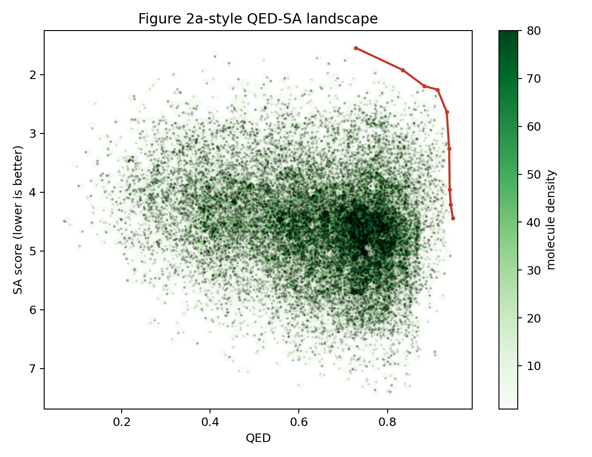
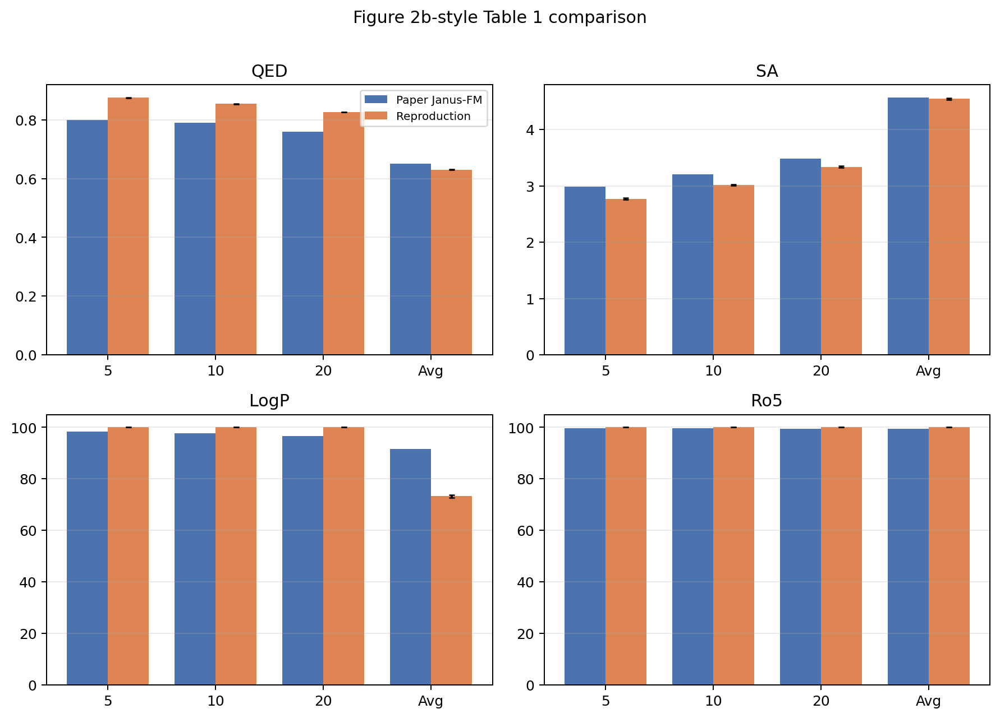
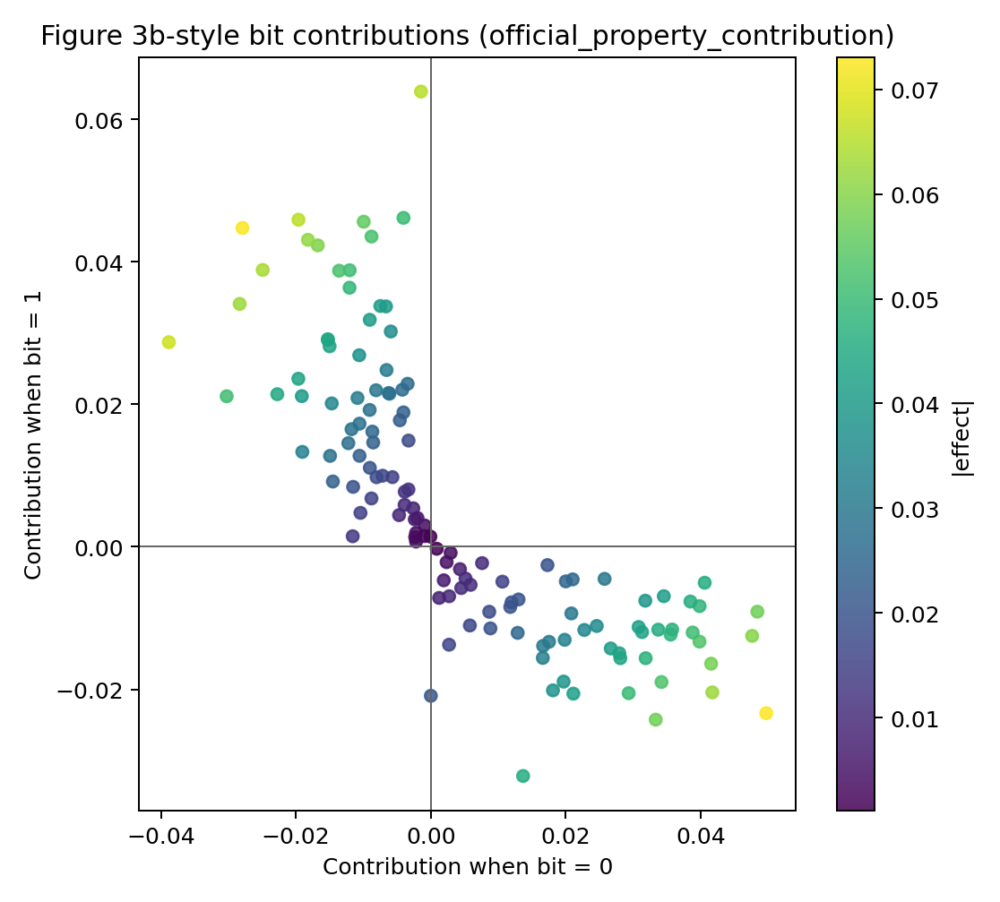
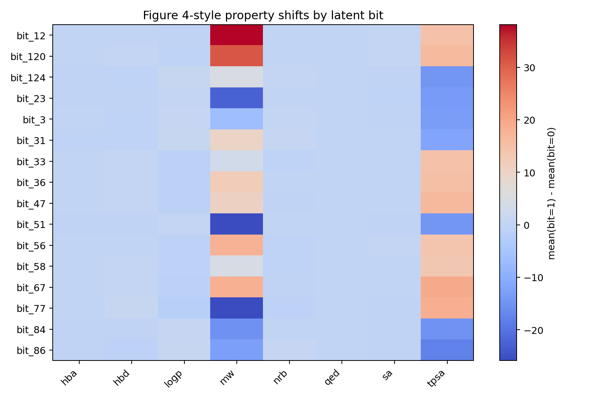

# Janus-QUBO Reproduction

This repository contains Janus-QUBO reproduction scripts and figure-ready outputs for the official artifact reproduction track.

## Quick Figure Preview

The PNGs below are generated from the official Janus-QUBO checkpoint and official QUBO matrix.

## Contents

- `repro/`: scripts for preprocessing, QUBO sampling, decoding/evaluation, FM-QUBO training, and figure-data generation.
- `paper_reproduction/experiment_a_official_artifact/`: aggregate CSVs, figure data, metadata, and PNG previews from Experiment A.

## Pull Request

Open a pull request from the `codex/janus-repro-code` branch to make these previews visible from the default branch.
